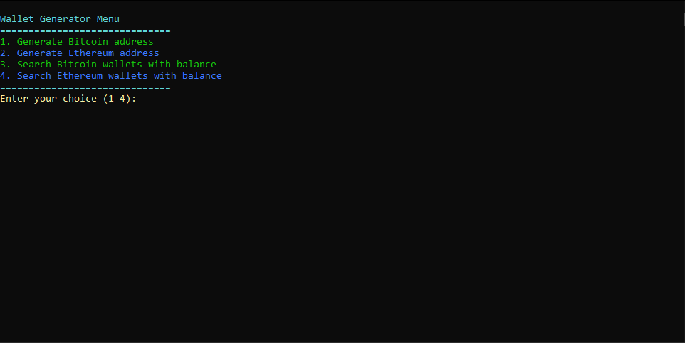
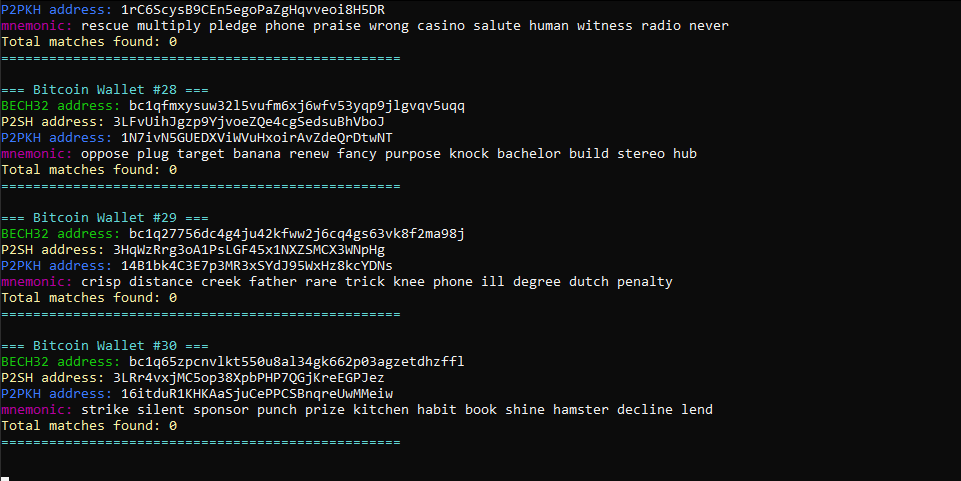

# CryptoDerived - Advanced Wallet Generator

A high-performance Rust-based cryptocurrency wallet generator that creates mnemonic phrases and derives wallet addresses for both Bitcoin and Ethereum using BIP32 standards. Features database integration for wallet recovery and balance checking.


## Features

- ✅ **Multi-Currency Support**: Generate Bitcoin and Ethereum wallets
- ✅ **Mnemonic Generation**: Generate BIP39-compliant 12-word mnemonic phrases
- ✅ **BIP32 Key Derivation**: Derive private keys using standard derivation paths
- ✅ **Multiple Bitcoin Address Types**: Generate Bech32 (P2WPKH), P2SH, and P2PKH addresses
- ✅ **Ethereum Address Generation**: Generate EIP-55 checksummed Ethereum addresses
- ✅ **Database Integration**: Check generated addresses against balance database
- ✅ **Continuous Generation**: Generate wallets continuously with real-time balance checking
- ✅ **Colored Output**: Beautiful terminal interface with colored output
- ✅ **Menu System**: Interactive menu for different wallet generation modes

## Installation

### Prerequisites

- Rust 1.70+ (install from [rustup.rs](https://rustup.rs/))
- Git

### Build from Source

```bash
git https://github.com/dauphongxd/cryptoderived.git
cd cryptoderived
cargo build --release
```

## Usage

### Interactive Menu

Run the application to see the interactive menu:

```bash
cargo run --release
```

### Menu Options

1. **Generate Bitcoin address** - Generate a single random Bitcoin wallet with all three address types
2. **Generate Ethereum address** - Generate a single random Ethereum wallet with EIP-55 checksummed address
3. **Search Bitcoin wallets with balance** - Continuously generate Bitcoin wallets and check against database
4. **Search Ethereum wallets with balance** - Continuously generate Ethereum wallets and check against database

### Command Line Options

```bash
cargo run --release -- --help
```

Available options:
- `--gpu, -g`: Enable GPU acceleration (placeholder for future implementation)
- `--verbose, -v`: Enable verbose output

### Example Output


**Single Bitcoin Wallet:**
```
=== BITCOIN WALLET ===
Mnemonic: abandon abandon abandon abandon abandon abandon abandon abandon abandon abandon abandon about
BECH32: bc1qcvjwexvscpktnae7xwe2fawqgnv6cewgheuy3k
P2SH: 3Py36noMxWBokZKA6qv5vaiu5iu5Usb17Z
P2PKH: 1BUzssG9JYhN13Z54X8QKuXqt8dJYkeZR9
```

**Single Ethereum Wallet:**
```
=== ETHEREUM WALLET ===
Mnemonic: abandon abandon abandon abandon abandon abandon abandon abandon abandon abandon abandon about
Ethereum: 0x9858EfFD232B4033E47d90003D41EC34EcaEda94
```

**Database Search with Match:**
```
=== Bitcoin Wallet #1234 ===
BECH32 address: bc1qxy2kgdygjrsqtzq2n0yrf2493p83kkfjhx0wlh
P2SH address: 3J1f2KV1HBMAcXrbQwmxaUw8WvhtFKUe4D
P2PKH address: 1HryvSjK2pfu5o2KEgX6nXaKpL4Uz4a61e
mnemonic: abandon abandon abandon abandon abandon abandon abandon abandon abandon abandon abandon about
WALLET WITH BALANCE FOUND!
💰 BECH32: bc1qxy2kgdygjrsqtzq2n0yrf2493p83kkfjhx0wlh (100826 satoshis)
Total matches found: 1
```

## Technical Details

### Derivation Paths

**Bitcoin:**
- **Bech32 (P2WPKH)**: `m/84'/0'/0'/0/0` (BIP84)
- **P2SH**: `m/49'/0'/0'/0/0` (BIP49) - Wrapped SegWit
- **P2PKH**: `m/44'/0'/0'/0/0` (BIP44) - Legacy addresses

**Ethereum:**
- **Standard**: `m/44'/60'/0'/0/0` (BIP44 with coin type 60)

### Database Integration

The application can load a database file (`database.txt`) containing addresses and their balances in the format:
```
address<TAB>balance_in_satoshis
```

This enables:
- **Wallet Recovery**: Find funds from known mnemonic phrases
- **Balance Checking**: Verify if generated addresses have funds
- **Continuous Scanning**: Generate wallets and check for matches in real-time

### Security Features

- Uses cryptographically secure random number generation (OsRng)
- Implements BIP39 mnemonic standard
- Follows BIP32 hierarchical deterministic key derivation
- All operations use the secp256k1 elliptic curve
- EIP-55 checksumming for Ethereum addresses

## Database Format

The database file should contain one address per line with the format:
```
34xp4vRoCGJym3xR7yCVPFHoCNxv4Twseo	24859757943601
bc1ql49ydapnjafl5t2cp9zqpjwe6pdgmxy98859v2	14057482554252
3M219KR5vEneNb47ewrPfWyb5jQ2DjxRP6	14039841918208
```

Where:
- First column: Bitcoin or Ethereum address
- Second column: Balance in satoshis (for Bitcoin) or wei (for Ethereum)
- Separated by tab character

## Development

### Building for Release

```bash
cargo build --release
```

The optimized binary will be in `target/release/crackedcrypto`.

### Dependencies

Key dependencies include:
- `bitcoin` - Bitcoin protocol implementation
- `bip39` - BIP39 mnemonic generation
- `bip32` - BIP32 key derivation
- `secp256k1` - Elliptic curve cryptography
- `sha3` - Keccak256 hashing for Ethereum
- `colored` - Terminal colors
- `tokio` - Async runtime

## Use Cases

- **Wallet Recovery**: Find funds from partially known mnemonic phrases
- **Address Verification**: Check if generated addresses have balances
- **Research**: Study address generation patterns and distributions
- **Educational**: Learn about BIP32 derivation and wallet generation

## Future Enhancements

- [ ] GPU acceleration using CUDA/OpenCL
- [ ] Support for additional cryptocurrencies
- [ ] Multi-signature wallet support
- [ ] Hardware wallet integration
- [ ] Web interface
- [ ] Batch processing optimization

## License

This project is for educational and research purposes. Please ensure compliance with local laws and regulations when using cryptocurrency tools.

## Disclaimer

This software is provided "as is" without warranty. Use at your own risk. Always verify generated addresses and keep mnemonic phrases secure. This tool is intended for legitimate wallet recovery and research purposes only.